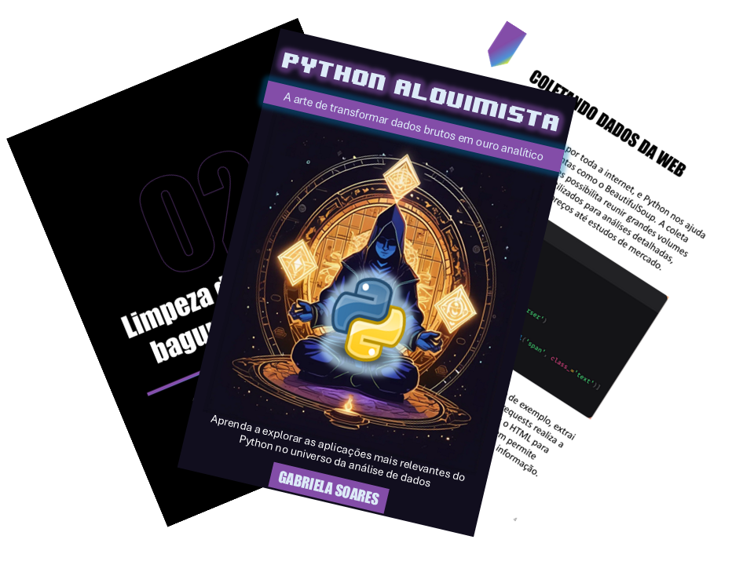

    

-------

# Projeto EBOOK Gerado por I.A.s

 > ℹ️ **NOTE:** Este é o repositório desenvolvido durante o curso "IA Generativa com Microsoft Copilot" na plataforma da [DIO](https://web.dio.me/track/coding-the-future-ia-generativa-microsoft-copilot)

Projeto com o objetivo de gerar um ebook digital com as facilidades das ferramentas de IA. 
Todos os prompts seguem abaixo.

<a href="https://github.com/felipeAguiarCode/prompts-recipe-to-create-a-ebook/blob/main/output/ebook%20-%20css%20jedi%20output.pdf" title="View PDF now"> 📕Clique aqui para ler</a>

## 💻 Tecnologias utilizadas no projeto

- [ChatGPT](https://chat.openai.com/) 
- [Pixlr](https://pixlr.com/br/image-generator/)
- [PowerPoint](https://www.microsoft.com/en/microsoft-365/powerpoint)

## 🧠 Prompts

ChatGPT：

|   Ação   | prompt                                                                                                                                                                                                                                                                         |
| :------: | ------------------------------------------------------------------------------------------------------------------------------------------------------------------------------------------------------------------------------------------------------------------------------ |
|  título  | Crie um título de um ebook sobre Python sobre seu uso no contexto de análise de dados. O título deve ser épico, nerd e tenha uma temática de magia. Sugira 5 títulos criativos para esse ebook | 

| conteúdo | 
Faça um texto para ebook, com foco em Python, com o título: ""Python e a alquimia dos dados:
Descubra a arte de transformar dados brutos em ouro analítico". Liste os principais uso do Python no contexto de análise de dados com exemplos de código
{REGRAS}
> Explique sempre de uma maneira simples, porém detalhada
> Sempre traga exemplos de código em contextos reais
> Sempre deixe um subtítulo sugestivo por tópico
> Tenha um tom mais nerd
> Após o código de exemplo explique o que o código faz |

Pixlr：

|  Ação  | prompt                                                                                 |
| :----: | -------------------------------------------------------------------------------------- |
| Imagem | an alchemist in a meditation pose, sitting cross-legged, on the floor an ancient alchemical symbol glowing and floating lightly in front of him, pixel art style |

## ✨ Features

- Conteúdo gerado via ChatGPT
- Imagens geradas via Pixlr

## 📚 Materiais

- Imagens utilizadas em `assets`
- ebook gerado durante as aulas em `output`

## 🛠️ Instruções de execução

Utilize os prompts acima nas ferramentas sugeridas para gerar o material base e utilize uma ferramenta de edição de documentos como power point, libreoffice , indesign para diagramação.

## 👨‍💻 Expert

    
    
&nbsp&nbsp&nbspGabriela Soares 
    &nbsp&nbsp&nbsp
    <a href="https://github.com/GabrielaSR">
    GitHub</a>&nbsp;|&nbsp;
    <a href="https://www.linkedin.com/in/gabrielasr/">LinkedIn</a>
&nbsp;|&nbsp;

  

---

⌨️ com 💜 por [Felipe Aguiar](https://github.com/felipeAguiarCode)
